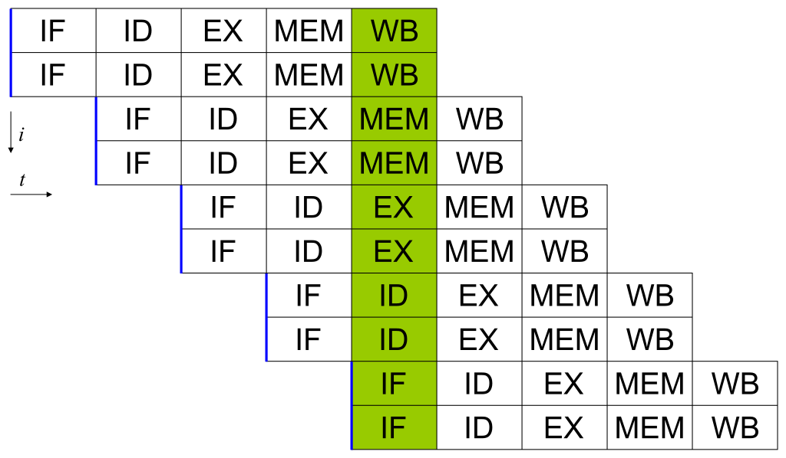
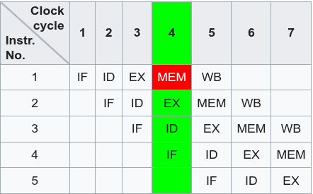

명령어 단계 병렬화(instruction-level parallelism)의 기법에는 대표적으로 명령어 파이프라이닝과
슈퍼스칼라가 있다. 명령어 파이프라이닝은 명령어 실행 단계를 세분화해 병렬성을 높히는 기법이며,
이렇게 단계를 세밀하게 나누는 것을 "파이프라인을 깊게 만든다"라고 한다. 슈퍼스칼라는 동시에 같은
단계를 다른 execution unit을 이용해서 처리하는 차이점이 있다. (위 - 슈퍼스칼라, 아래 - 파이프라이닝)

해당 문제에서는 "...이를 분화시키려는 다양한 연구가 존재한다"라고 언급했으므로 파이프라이닝이
정답이다.