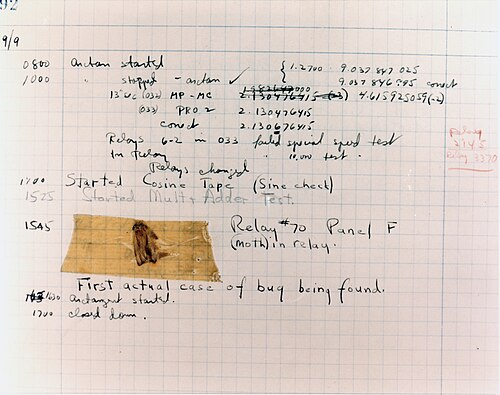

초기 프로그래머인 Grace Hopper가 하버드 마크II 컴퓨터의 오류를 디버깅하던 중 선 사이에 끼인 벌레가
원인이란 것을 발견했다는 일화에 근거에 출제된 문제입니다. (아래 사진 참조)

하지만 해당 사진에 주변에 쓰인 문구인 "First actual case of bug being found"에서도 알 수 있듯이,
훨씬 오래전부터 "버그"는 공학에서 오류를 의미하는 말로 쓰이고 있었습니다.