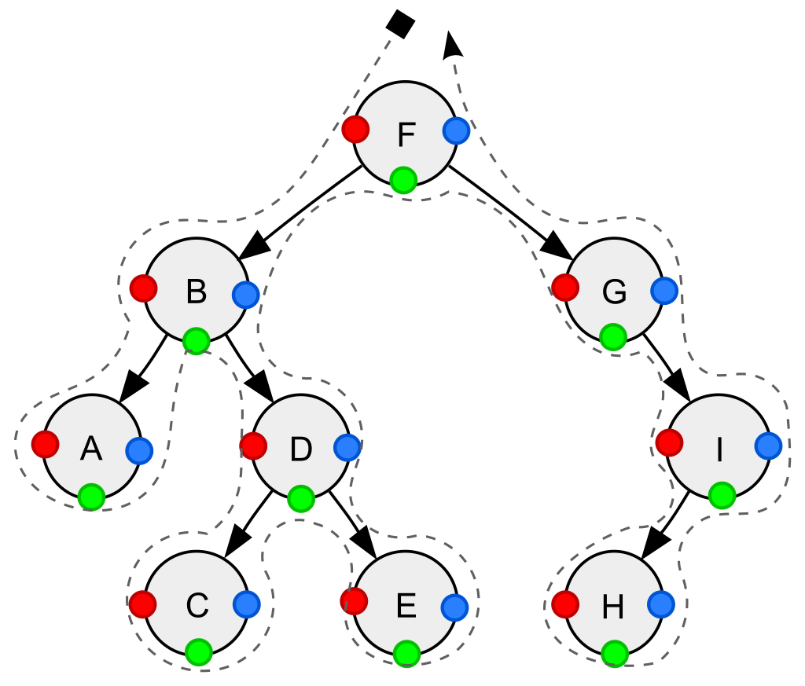

9+7 = 16

이진 트리의 순회 방법은 크게 Depth-first와 Breadth-first traversal로 나뉘고, Depth-first traversal 중 제일 기본적인 세가지 순회 방식이 preorder/postorder/inorder traversal 이다. 이 세 가지 순회 방식을 다음 그림과 같이 일반화할 수 있다.

- 빨간 점(각 노드의 왼쪽)을 순회하는 순서 = preorder
- 초록 점(각 노드의 아래)를 순회하는 순서 = inorder
- 파란 점(각 노드의 오른쪽)을 순회하는 순서 = postorder

쓸 곳이 많으니 꼭 알아두자.